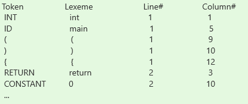

## Objective
In this milestone, we have to construct a scanner for the source language to output the tokens in a tabular form.

Specifically we have to do the following:

1. Prepare  the token specification for C language. 
2. Modify the lexer script to detect tokens.
3. Submit 5 non-trivial programs that can be processed with our compiler (milestone 1).

### OUTPUT

The output of the scanner should be a table describing the stream of tokens. It should list the line number and the column number where the token starts, and the lexeme associated with the token. We can ignore whitespaces from the table, but do count them for column number and line number calculations. For simplicity, we can assume all tabs use fixed number of columns (1or 4 or 8 ...).

For example :

Input.c:

```
int main() 
{
 return 0;
}
```


#### Sample Output of Scanner:


